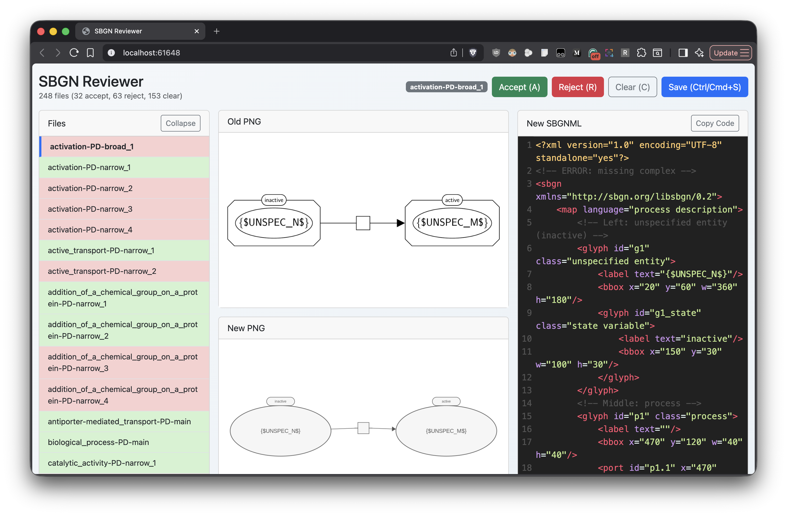

# SBGN Reviewer

A lightweight Node.js + Bootstrap app for reviewing SBGN triplets (SBGN XML, old PNG, new PNG) with status tracking and editable XML.



## Features
- Loads triplets with matching basenames across `.sbgn` and `.png` files.
- Editable, syntax-highlighted XML with CodeMirror.
- Up/down arrow file navigation.
- Accept/Reject/Clear status tracking stored in `output.json`.
- Saves edited copies as `<basename>_comment.sbgn` in the output folder.
- Resizes images on the server if they exceed the configured max dimension (aspect ratio preserved).

## Setup
1. Install dependencies:
   ```bash
   npm install
   ```
2. Review `config.json` and update folder paths as needed.
3. Start the server:
   ```bash
   npm start
   ```
4. Open `http://localhost:3000` in your browser.

## Configuration
Edit `config.json`:
- `sbgn_dir`: folder with `.sbgn` files
- `old_png_dir`: folder with old `.png` files
- `new_png_dir`: folder with new `.png` files
- `output_dir`: folder where `output.json` and `_comment.sbgn` files are stored
- `max_image_dimension`: max width/height for server-side image resizing

## Notes
- `output.json` is created on first load if it does not exist.
- Status values are `accept`, `reject`, or `null`.
